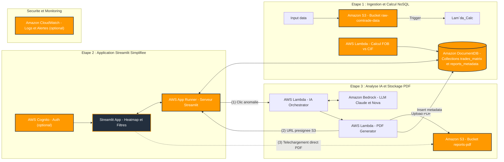

```mermaid
graph LR
    subgraph DataPipeline ["Etape 1 : Ingestion et Calcul NoSQL"]
        direction TB
        InputData["Input data"]
        S3_Raw["Amazon S3 - Bucket raw-comtrade-data"]
        Lambda_Calc["AWS Lambda - Calcul FOB vs CIF"]
        %% Rules["Regles Anomalies : FOB plus grand que CIF ou Gap plus grand que 35%"]
        DocDB[("Amazon DocumentDB - Collections trades_matrix et reports_metadata")]

        InputData --> S3_Raw
        S3_Raw -- Trigger --> Lam`da_Calc
        %% Lambda_ETL --> Lambda_Calc
        Lambda_Calc --> DocDB
        %% Rules -.-> Lambda_Calc
    end

    subgraph AppBackend ["Etape 2 : Application Streamlit Simplifiee"]
        direction TB
        Cognito["AWS Cognito - Auth (optional)"]
        UI["Streamlit App - Heatmap et Filtres"]
        AppRunner["AWS App Runner - Serveur Streamlit"]

        Cognito --> UI
        UI <--> AppRunner
        AppRunner <--> DocDB
    end

    subgraph AIGeneration ["Etape 3 : Analyse IA et Stockage PDF"]
        direction TB
        Lambda_AI["AWS Lambda - IA Orchestrator"]
        Bedrock["Amazon Bedrock - LLM Claude et Nova"]
        Lambda_PDF["AWS Lambda - PDF Generator"]
        S3_Reports["Amazon S3 - Bucket reports-pdf"]

        Lambda_AI <--> Bedrock
        Lambda_AI --> Lambda_PDF
        Lambda_PDF -- "Upload PDF" --> S3_Reports
        Lambda_PDF -- "Insert metadata" --> DocDB
    end

    subgraph Transversal ["Securite et Monitoring"]
        direction TB
        CloudWatch["Amazon CloudWatch - Logs et Alertes (optional)"]
    end

    AppRunner -- "(1) Clic anomalie" --> Lambda_AI
    Lambda_PDF -- "(2) URL presignee S3" --> AppRunner
    UI -. "(3) Telechargement direct PDF" .-> S3_Reports

    classDef aws fill:#FF9900,stroke:#232F3E,stroke-width:2px,color:#FFFFFF;
    classDef client fill:#232F3E,stroke:#FF9900,stroke-width:2px,color:#FFFFFF;
    classDef ai fill:#147EBA,stroke:#232F3E,stroke-width:2px,color:#FFFFFF;

    class S3_Raw,S3_Reports,Lambda_Calc,DocDB,Cognito,CloudWatch,AppRunner aws;
    class UI client;
```