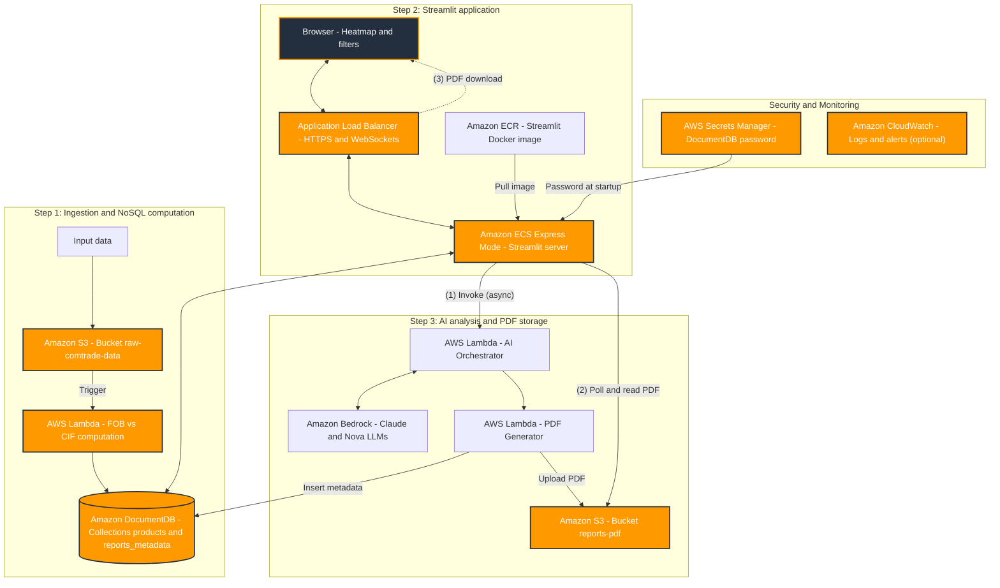

```mermaid
graph TB
    subgraph DataPipeline ["Step 1: Ingestion and NoSQL computation"]
        direction TB
        InputData["Input data"]
        S3_Raw["Amazon S3 - Bucket raw-comtrade-data"]
        Lambda_Calc["AWS Lambda - FOB vs CIF computation"]
        %% Rules["Anomaly rules: FOB greater than CIF or gap greater than 35%"]
        DocDB[("Amazon DocumentDB - Collections products and reports_metadata")]

        InputData --> S3_Raw
        S3_Raw -- Trigger --> Lambda_Calc
        %% Lambda_ETL --> Lambda_Calc
        Lambda_Calc --> DocDB
        %% Rules -.-> Lambda_Calc
    end

    subgraph AppBackend ["Step 2: Streamlit application"]
        direction TB
        UI["Browser - Heatmap and filters"]
        ALB["Application Load Balancer - HTTPS and WebSockets"]
        ECR["Amazon ECR - Streamlit Docker image"]
        ECS["Amazon ECS Express Mode - Streamlit server"]

        UI <--> ALB
        ALB <--> ECS
        ECR -- "Pull image" --> ECS
        ECS <--> DocDB
    end

    subgraph AIGeneration ["Step 3: AI analysis and PDF storage"]
        direction TB
        Lambda_AI["AWS Lambda - AI Orchestrator"]
        Bedrock["Amazon Bedrock - Claude and Nova LLMs"]
        Lambda_PDF["AWS Lambda - PDF Generator"]
        S3_Reports["Amazon S3 - Bucket reports-pdf"]

        Lambda_AI <--> Bedrock
        Lambda_AI --> Lambda_PDF
        Lambda_PDF -- "Upload PDF" --> S3_Reports
        Lambda_PDF -- "Insert metadata" --> DocDB
    end

    subgraph Transversal ["Security and Monitoring"]
        direction TB
        Secrets["AWS Secrets Manager - DocumentDB password"]
        CloudWatch["Amazon CloudWatch - Logs and alerts (optional)"]
    end

    Secrets -- "Password at startup" --> ECS
    ECS -- "(1) Invoke (async)" --> Lambda_AI
    ECS -- "(2) Poll and read PDF" --> S3_Reports
    ALB -. "(3) PDF download" .-> UI

    classDef aws fill:#FF9900,stroke:#232F3E,stroke-width:2px,color:#FFFFFF;
    classDef client fill:#232F3E,stroke:#FF9900,stroke-width:2px,color:#FFFFFF;
    classDef ai fill:#147EBA,stroke:#232F3E,stroke-width:2px,color:#FFFFFF;

    class S3_Raw,S3_Reports,Lambda_Calc,DocDB,Cognito,CloudWatch,ECS,ALB,Secrets aws;
    class UI client;
```
